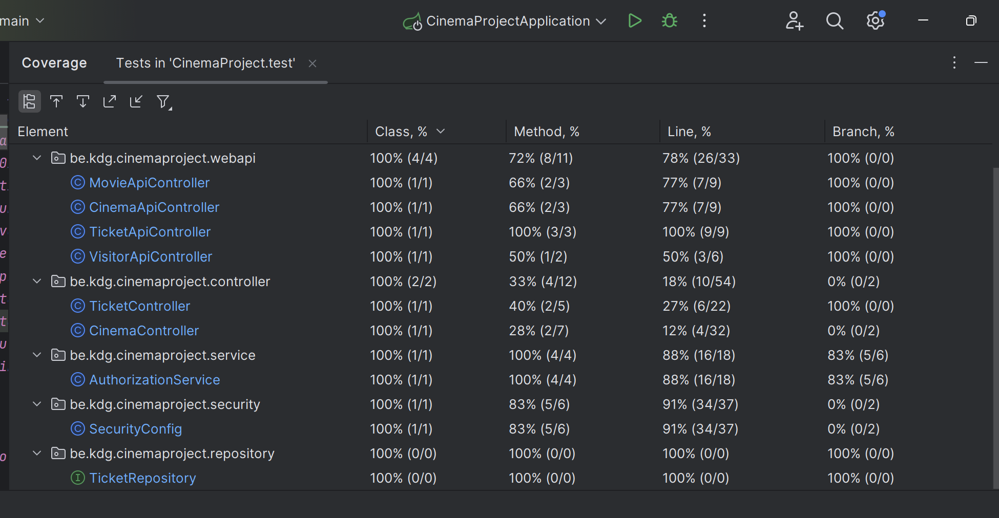

# Programming 5
###### Name: Liza
###### Surname: Kolosova
###### KdG email: liza.kolosova@student.kdg.be
###### Student ID: 0167456-34
###### Academic year: 2024-2025
###### Group: ACS201
###### Domain entities: cinema screen (many) -(one) cinema (one) - (many) ticket (many) - (one) movie. Ticket is how I handle many-to-many relationship between movie and cinema so basically my initial domain was cinema screen - cinema - movie.
###### Build and Run Instructions:
###### You need Java 17+ and Gradle.
###### To build the project with gradle: ./gradlew clean build
###### To run the project with gradle: ./gradlew bootRun
###### To run the test with gradle: ./gradlew test
###### To run the test with gradle and profile test on Windows: ./gradlew test "-Dspring.profiles.active=test"( ./gradlew test -Dspring.profiles.active=test )
###### I assume you can run the test without quotes("") but for Windows (or just me) it didn't work.
###### Additional info: use can access my page from http://localhost:8080/ only and then you will navigate through navbar.

# Week 2

## Searching for movies - OK
```http
GET http://localhost:8080/api/movies?title=Toy Story
Accept: application/json

HTTP/1.1 200 
Content-Type: application/json
Transfer-Encoding: chunked
Date: Sun, 23 Feb 2025 20:57:19 GMT

[
  {
    "id": 2,
    "title": "Toy Story 4",
    "releaseDate": "2019-06-21",
    "genre": "ANIMATION"
  }
]
Response file saved.
> 2025-02-23T215719.200.json

Response code: 200; Time: 117ms (117 ms); Content length: 79 bytes (79 B)
```
## Searching for movies - No content
```http
GET http://localhost:8080/api/movies?title=fckdfsnf
Accept: application/json

HTTP/1.1 204 
Date: Tue, 18 Feb 2025 16:28:14 GMT

<Response body is empty>

Response code: 204; Time: 20ms (20 ms); Content length: 0 bytes (0 B)
```
## Deleting one movie - No Content
```http
DELETE http://localhost:8080/api/movies/2

HTTP/1.1 204 
Date: Tue, 18 Feb 2025 16:28:32 GMT

<Response body is empty>

Response code: 204; Time: 139ms (139 ms); Content length: 0 bytes (0 B)
```
## Deleting one movie - Not Found
```http
DELETE http://localhost:8080/api/movies/9

HTTP/1.1 404 
Content-Length: 0
Date: Tue, 18 Feb 2025 16:28:53 GMT

<Response body is empty>

Response code: 404; Time: 25ms (25 ms); Content length: 0 bytes (0 B)
```
## Deleting one cinema - No content

```http
DELETE http://localhost:8080/api/cinemas/1

HTTP/1.1 204
Date: Wed, 19 Feb 2025 19:34:39 GMT

<Response body is empty>

Response code: 204; Time: 91ms (91 ms); Content length: 0 bytes (0 B)
```

## Deleting one cinema - Not Found

```http
DELETE http://localhost:8080/api/cinemas/9

HTTP/1.1 404 
Content-Length: 0
Date: Wed, 19 Feb 2025 19:36:49 GMT

<Response body is empty>

Response code: 404; Time: 18ms (18 ms); Content length: 0 bytes (0 B)
```

# Week 3

## Creating one ticket - Created

```http
POST http://localhost:8080/api/tickets
Accept: application/json
Content-Type: application/json

{
  "price": 14,
  "showtime": "2025-02-26T15:30:00",
  "format": "3D",
  "availability": "AVAILABLE",
  "image": "ticket1.jpg"
}

HTTP/1.1 201 
Content-Type: application/json
Transfer-Encoding: chunked
Date: Sun, 23 Feb 2025 20:59:13 GMT

{
  "id": 16,
  "price": 14.0,
  "showtime": "2025-02-26T15:30:00",
  "format": "3D",
  "availability": "AVAILABLE"
}
Response file saved.
> 2025-02-23T215913.201.json

Response code: 201; Time: 17ms (17 ms); Content length: 96 bytes (96 B)
```

## Creating one ticket - Bad request

```http
POST http://localhost:8080/api/tickets
Accept: application/json
Content-Type: application/json

{
  "price": 14,
  "showtime": "2025-02-26T15:30:00",
  "format": "3D",
  "availability": "AVAILABLE",
  "image": ""
}

POST http://localhost:8080/api/tickets

HTTP/1.1 400 
Content-Type: application/json
Transfer-Encoding: chunked
Date: Mon, 24 Feb 2025 18:38:01 GMT
Connection: close

{
  "timestamp": "2025-02-24T18:38:01.870+00:00",
  "status": 400,
  "error": "Bad Request",
  "path": "/api/tickets"
}
Response file saved.
> 2025-02-24T193801.400.json

Response code: 400; Time: 291ms (291 ms); Content length: 102 bytes (102 B)

```


## Update(patch) one ticket - No content

```http
PATCH http://localhost:8080/api/tickets/12
Accept: application/json
Content-Type: application/json

{
  "price": 15,
  "showtime": "2025-02-26T15:30:00",
  "availability": "AVAILABLE"
}

HTTP/1.1 204 
Content-Type: application/json
Date: Sun, 23 Feb 2025 21:02:16 GMT

<Response body is empty>

Response code: 204; Time: 39ms (39 ms); Content length: 0 bytes (0 B)
```

## Update(patch) one ticket - Bad request

```http
PATCH http://localhost:8080/api/tickets/12
Accept: application/json
Content-Type: application/json

{
"price": 100,
"showtime": "2025-02-26T15:30:00",
"availability": "AVAILABLE"
}

HTTP/1.1 400 
Content-Type: application/json
Transfer-Encoding: chunked
Date: Sun, 23 Feb 2025 21:04:18 GMT
Connection: close

{
  "timestamp": "2025-02-23T21:04:18.520+00:00",
  "status": 400,
  "error": "Bad Request",
  "path": "/api/tickets/12"
}
Response file saved.
> 2025-02-23T220418.400.json

Response code: 400; Time: 9ms (9 ms); Content length: 105 bytes (105 B)
```

## Update(patch) one ticket - Not found

```http
PATCH http://localhost:8080/api/tickets/19
Accept: application/json
Content-Type: application/json

{
"price": 14,
"showtime": "2025-02-26T15:30:00",
"availability": "AVAILABLE"
}

HTTP/1.1 404 
Content-Type: application/json
Transfer-Encoding: chunked
Date: Sun, 23 Feb 2025 21:05:27 GMT

{
  "timestamp": "2025-02-23T21:05:27.139+00:00",
  "status": 404,
  "error": "Not Found",
  "path": "/api/tickets/19"
}
Response file saved.
> 2025-02-23T220527.404.json

Response code: 404; Time: 17ms (17 ms); Content length: 103 bytes (103 B)
```

# Week 4
## Users that I added:
### User 1:
##### username: liza.kolosova@student.kdg.be
##### password: student
##### role: administrator
### User 2:
##### username: raoul@kdg.be
##### password: test
##### role: visitor

## A page that can be accessed by anyone:
[Cinemas page](http://localhost:8080/cinemas)
## A hyperlink to a page that requires authentication to be accessible:
[Add Ticket page](http://localhost:8080/tickets/add)

# Week 5
## Users are the same.

##### So, unauthenticated user can access pages with all cinemas, movies, tickets and homepage
##### Visitor can update ticket and delete it if they are the owner of that ticket
##### Administrator can add and delete cinemas and movies, also update and delete all tickets.

## Pages where I hide delete button for unauthenticated users: 
# [Cinemas page](http://localhost:8080/cinemas)
# [Movies page](http://localhost:8080/movies)
# [Tickets page](http://localhost:8080/tickets)

## User has relationship to ticket entity.

# Week 6
## I added profile test for running tests

# Week 8
## The names of the classes containing
### MVC integration tests:
##### MovieControllerIntegrationTest
### API integration tests:
##### CinemaApiControllerIntegrationTest
##### TicketApiControllerIntegrationTest
##### MovieApiControllerIntegrationTest
### Role verification tests
##### CinemaApiControllerIntegrationTest
##### TicketApiControllerIntegrationTest
# Test coverage:


##### Movie controller on the second picture is MVC

# Week 10
## The names of the classes containing
### Mocking tests
##### TicketApiControllerTest
##### TicketServiceImplTest
### 'verify' tests
##### TicketApiControllerTest
##### TicketServiceImplTest

# [Markdown hyperlink to a test report of a recent successful pipeline.](https://gitlab.com/kdg-ti/programming-5/projects-24-25/acs201/liza.kolosova/spring-backend/-/jobs/9995803903)

# Week 12
## Bootstrap icons:
##### -  bi-camera-reels-fill, bi-building, bi-film, bi-ticket-perforated, bi-plus-circle-dotted, bi-plus-circle, bi-plus-circle-fill, bi-plus-square,  bi-search, bi-box-arrow-in-right
##### the URL(actually it's in navbar so you can see it on every page): 
##### [Cinemas page](http://localhost:8080/cinemas)
##### and the source file is fragments.html

## Custom client-side validation:
##### the url where I implemented it: [Login](http://localhost:8080/login) and [Add ticket](http://localhost:8080/tickets/add)
##### the source file where I implemented it: login-validation.js and add-ticket-validation.js

##  JavaScript dependencies:
### I added sweetalert2, animejs and confetti. Also validator

### Where you can find them: 
##### sweetalert2 - patch-ticket.js (line 8, then 34), delete-element.js.(line 18, then 60), add-visitor.js, add-ticket.js
##### animejs - delete-element.js (line 50-63)
##### confetti - confetti.js
##### validator - login-validation.js, add-ticket-validation.js

### Sweetalert2+confetti steps:
##### 1. Log in (doesn't matter as who)
##### 2. [Click on this link](http://localhost:8080/tickets/details/2)
##### 3. Click edit ticket 
##### 4. Set price
##### 5. Save

### Sweetalert2+Animejs steps (they are both involved in it):
##### 1. Log in (doesn't matter as who)
##### 2. go to all tickets page through navbar
##### 3. Click "delete"

### Validator steps:
##### 1. Just put nothing and press log in.


